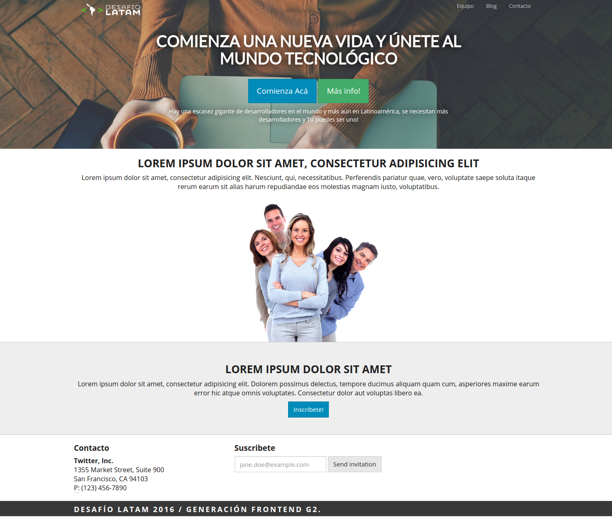
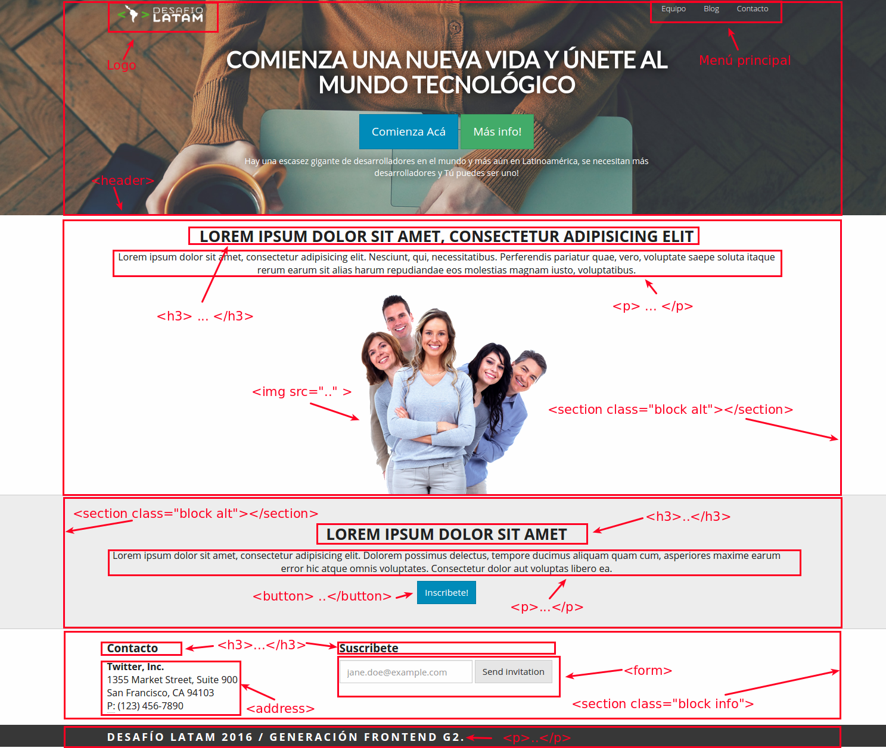

#Mi primer landing page

Genial ahora pondremos en práctica lo que aprendimos de HTML y CSS pero agregaremos un componente nuevo y es bootstrap. imagino que estas pensando que es bootstrap, bueno Boostrap es un framework mobile first desarrollado por la gente de Twitter y liberado a la comunidad; nos permite desarrollar sitios web responsive e interfaces de forma rápida combinando CSS, HTML5 y Jquery, y es eso lo que vamos a realizar ahora.

Como desafío vamos enseñar a construir el siguiente landing page




Ya verás que con bootstrap no es complejo y podremos poner nuestros conocimientos en práctica, asi que manos a la obra!!.

## Hints
### Definiendo las secciones de nuestro landing
Para construir nuestro landing lo primero que debemos es mirar nuestro diseño y segmentarlo en los diferentes bloques que estan propuestos, para definir cada bloque utilizaremos de forma correcta las etiquetas de HTML5 como header, footer, aside y section. Si quieres saber más de esto revisa el siguiente [link](http://www.w3schools.com/html/html5_semantic_elements.asp).



Lo que se presenta en la foto anterio lo debemos llevar código.

### Esquema HTML base
El esqueleto de nuestro landing lo definiremos de la siguiente forma

```
  <header>

  </header>

  <section class="block">
    
  </section>

  <section class="block alt">
    
  </section>

  <section class="block info">
    
  </section>

  <footer>
    
  </footer>

```

Esto es solo una guía de como debería ser la estructura base a desarrollar. Los recursos que se necesitan como fotos y logos los puedes descargar desde [acá](images/images.zip)